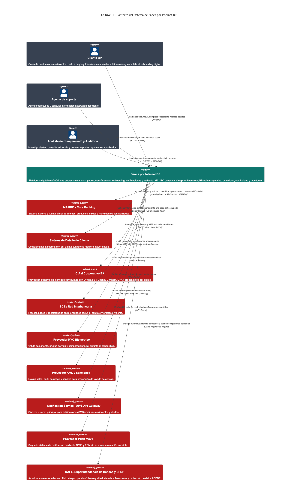
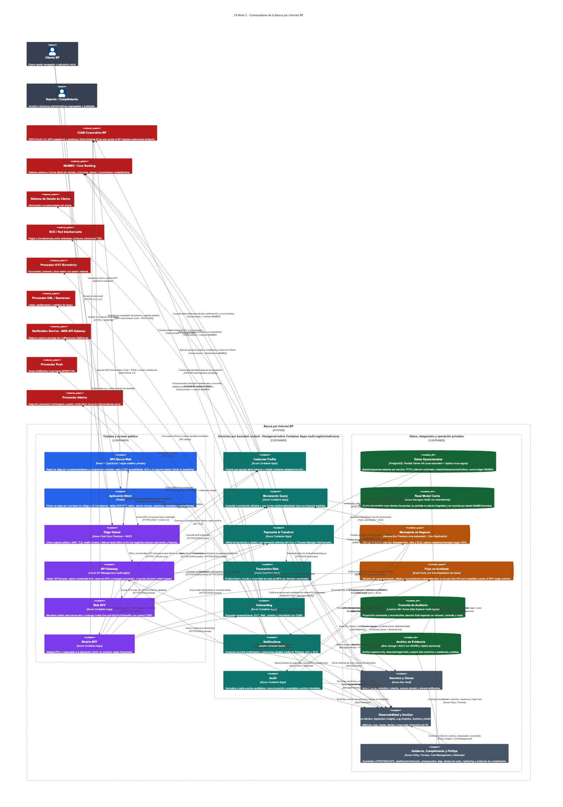
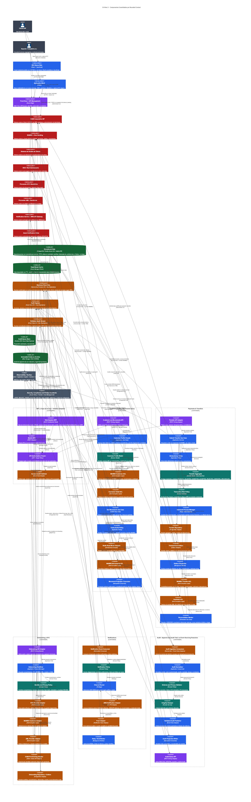

# Informe técnico de arquitectura de solución

## Banca por Internet BP

| Campo | Valor |
|---|---|
| Tipo de documento | Informe técnico de arquitectura de solución |
| Autoría | Arquitectura de Soluciones |
| Estado | Propuesta para revisión |
| Fecha de referencia | 14 de agosto de 2026 |
| Plataforma objetivo | Microsoft Azure |
| Método de documentación | arc42 adaptado + modelo C4 |
| Niveles C4 incluidos | Contexto, Contenedores y Componentes |

> Este documento describe una arquitectura objetivo, no una implementación productiva ya certificada. Los contratos del Core, los volúmenes, los SLO, el RTO/RPO, la residencia de datos y las obligaciones regulatorias definitivas deben ser aprobados por BP, Seguridad, Riesgos, Cumplimiento, Legal/DPO y Operaciones.

## Resumen ejecutivo

BP necesita una plataforma de banca digital para web y móvil que permita consultar perfiles y movimientos, realizar pagos y transferencias propias e interbancarias, incorporar nuevos clientes con reconocimiento facial y notificar las operaciones por más de un canal.

La propuesta utiliza servicios desacoplados por capacidad de negocio, integración síncrona para las respuestas que el cliente necesita de inmediato y mensajería durable para efectos secundarios como auditoría, actualización de vistas y notificaciones. **MAMBO - Core Banking continúa siendo un sistema externo y la fuente oficial de saldos, productos y movimientos contabilizados**. Del mismo modo, **Notification Service - AWS API Gateway se considera un sistema externo**, no un componente desplegado dentro de BP o Azure.

La arquitectura se apoya en cinco ideas centrales:

1. Seguridad y privacidad desde el diseño, con OAuth 2.0/OIDC, PKCE, MFA adaptativa, Zero Trust y mínimo privilegio.
2. Responsabilidades separadas mediante DDD, bounded contexts y arquitectura hexagonal.
3. Integridad transaccional mediante idempotencia, máquina de estados, Saga acotada y Transactional Outbox.
4. Alta disponibilidad y recuperación verificables, evitando promesas de consistencia que los sistemas distribuidos no pueden garantizar.
5. Operación sostenible mediante observabilidad, automatización, gobierno y FinOps.

## 1. Introducción y objetivos

### 1.1 Objetivo del documento

Presentar una solución técnicamente defendible y trazable para la banca digital BP. El informe explica qué se propone, por qué se propone, qué opciones se evaluaron y qué riesgos o condiciones deben validarse antes de implementar.

La organización del documento sigue la estructura profesional de **arc42**: objetivos, restricciones, contexto, estrategia, bloques, ejecución, despliegue, conceptos transversales, decisiones, calidad, riesgos y glosario. Los tres diagramas se expresan con **C4**, porque cada nivel responde a una audiencia y una pregunta distinta.

### 1.2 Alcance funcional

La solución cubre:

- consulta de datos básicos, productos e información detallada del cliente;
- consulta paginada del histórico de movimientos;
- pagos y transferencias entre cuentas propias;
- pagos y transferencias interbancarias;
- SPA web y aplicación móvil multiplataforma;
- autenticación con el CIAM corporativo de BP;
- onboarding móvil con documento, prueba de vida y comparación facial;
- notificaciones por SMS/correo y push, con proveedor alterno cuando corresponda;
- registro inmutable y consulta controlada de auditoría;
- caché/read model para clientes frecuentes;
- monitoreo, seguridad, HA, DR, auto-healing y control de costos.

### 1.3 Fuera de alcance

- Reemplazar el ledger o la contabilidad de MAMBO.
- Definir contratos que todavía no han sido entregados por MAMBO, BCE/red interbancaria o proveedores.
- Certificar cumplimiento legal o seguridad productiva solo a partir del diagrama.
- Fijar cifras de disponibilidad, RTO, RPO, retención o capacidad sin BIA, datos de volumen y aprobación de BP.

### 1.4 Objetivos de calidad prioritarios

| Prioridad | Objetivo | Resultado esperado |
|---:|---|---|
| 1 | Integridad financiera | Un reintento o mensaje duplicado no debe producir un segundo débito. MAMBO confirma el resultado oficial. |
| 2 | Seguridad y privacidad | No se exponen tokens, secretos o biometría en el navegador, caché, telemetría ni auditoría. |
| 3 | Disponibilidad y recuperación | La solución tolera la pérdida de una instancia o zona y cuenta con failover regional probado según el BIA. |
| 4 | Trazabilidad | Una operación se sigue de extremo a extremo con `correlationId`, eventos auditables y evidencia inmutable. |
| 5 | Evolución y operación | Cada capacidad puede cambiar y escalar con impacto controlado, observabilidad y costo visible. |

### 1.5 Interesados

| Interesado | Necesidad principal |
|---|---|
| Cliente BP | Servicio seguro, disponible, rápido y con estados comprensibles. |
| Negocio/Product Owner | Funcionalidades trazables a valor y evolución predecible. |
| Operaciones/SRE | SLO, alertas, runbooks, rollback, capacidad y recuperación medible. |
| Seguridad/Fraude | Prevención de abuso, control de identidad y evidencia accionable. |
| Cumplimiento, Legal y DPO | Privacidad, retención, AML y atención a autoridades con sustento verificable. |
| Desarrollo/QA | Límites claros, contratos versionados y componentes probables de forma aislada. |
| Auditoría | Evidencia íntegra, consultable y con segregación de funciones. |

## 2. Restricciones y supuestos

| Restricción o supuesto | Impacto arquitectónico |
|---|---|
| MAMBO es externo y fuente oficial | La plataforma no crea un segundo ledger; usa ACL, idempotencia y reconciliación. |
| El sistema de detalle de cliente es independiente | Customer Profile agrega ambas fuentes sin compartir sus modelos internos. |
| BP ya dispone de un CIAM OAuth 2.0 | Se configura OIDC/PKCE; no se construye un proveedor de identidad propio. |
| Existen web y móvil | Se diseñan seguridad, sesión y payload por canal mediante BFF. |
| El onboarding es móvil y biométrico | La biometría se aísla, minimiza y somete a evaluación de impacto. |
| Se requieren al menos dos mecanismos de notificación | Se aplica Strategy y proveedores desacoplados, sin revertir la transacción por un fallo de entrega. |
| Azure es la nube objetivo | Se prefieren PaaS administrados, acceso privado, identidad administrada y despliegue regional. |
| Los contratos externos no están cerrados | Protocolos específicos aparecen como `TBD`; ISO 20022 solo se usa si el contrato vigente lo exige. |

Antes de congelar el diseño, BP debe confirmar volúmenes y picos, SLA del Core, contratos de red, regiones permitidas, período de retención, RTO/RPO, proveedor KYC, proveedor AML y alcance PCI DSS.

## 3. Contexto y alcance

### 3.1 Cómo leer los diagramas

La paleta distingue responsabilidades:

| Color | Significado |
|---|---|
| Gris | Personas, seguridad, gobierno y operación. |
| Azul | Canales y componentes de aplicación. |
| Morado | Edge, API y adaptación por canal. |
| Turquesa | Dominio y capacidades de negocio. |
| Naranja | Integración, adaptadores y mensajería. |
| Verde | Persistencia, caché y evidencia. |
| Rojo | Sistemas externos a la solución BP. |

Las flechas indican propósito y protocolo. No representan por sí solas confianza: toda llamada externa requiere autenticación, autorización, timeout, telemetría y tratamiento de error coherente con el negocio.

### 3.2 Modelo C4 de Contexto

**Figura 1 — Contexto.** Presenta a BP como una caja negra y muestra quién la utiliza y de qué sistemas depende. El cliente accede por web o móvil; soporte y cumplimiento usan funciones segregadas. La solución consulta y ordena operaciones a MAMBO, complementa el perfil, delega identidad al CIAM y se integra con red interbancaria, KYC, AML, notificaciones y autoridades.

Dos límites son deliberados y no deben reinterpretarse en niveles posteriores:

- **MAMBO - Core Banking es externo.** Es la fuente oficial de clientes, cuentas, productos, saldos y movimientos contabilizados.
- **Notification Service - AWS API Gateway es externo.** BP solo consume su contrato HTTPS para SMS/correo; su API Gateway no forma parte de la infraestructura Azure de BP.

### 3.3 Contexto técnico de integración

| Relación | Propósito | Protocolo/control esperado |
|---|---|---|
| Canales → BP | Operación del cliente | HTTPS TLS 1.2+, OAuth 2.0/OIDC, rate limit. |
| BP → CIAM | Login, MFA, step-up y vinculación | Authorization Code + PKCE `S256`, OIDC. |
| BP → MAMBO | Consultas y contabilización | Canal privado, contrato MAMBO, idempotencia y correlación. |
| BP → BCE/red | Instrucción y consulta interbancaria | mTLS/canal B2B; formato contractual `TBD`. |
| BP → KYC/AML | Validación de identidad y riesgo | API/SDK cifrado, callback firmado y datos minimizados. |
| BP → AWS Notifications | SMS/correo | HTTPS, credencial rotada y circuito de protección. |
| BP → Push | Alerta móvil | API cifrada; contenido no sensible. |

## 4. Estrategia de solución

La plataforma adopta una arquitectura distribuida moderada: se separan únicamente capacidades con reglas, datos o ritmos de cambio distintos. Los servicios síncronos atienden consultas y comandos inmediatos; Service Bus distribuye eventos de negocio y Event Hubs transporta el flujo de auditoría. Cada servicio conserva su estado operativo, mientras MAMBO mantiene el estado financiero oficial.

La estrategia por objetivo es la siguiente:

| Objetivo | Estrategia aplicada |
|---|---|
| Desacoplamiento | DDD, bounded contexts, puertos/adaptadores, contratos versionados y eventos. |
| Integridad | Idempotencia, Aggregate, State Machine, Outbox y reconciliación. |
| Baja latencia | Front Door, BFF, paginación y Cache-Aside reconstruible. |
| Seguridad | CIAM, OIDC/PKCE, MFA, WAF, Zero Trust, Managed Identity y Key Vault. |
| Resiliencia | Multi-zona, segunda región, timeout, circuit breaker, bulkhead, retry selectivo y DLQ. |
| Auditoría | Eventos sanitizados, append-only, sello de integridad, proyección y WORM. |
| Operación | OpenTelemetry, Azure Monitor/Sentinel/Defender, SLO y runbooks. |
| Costo | Servicios administrados, autoscaling, presupuestos, tags, retención por niveles y rightsizing. |

## 5. Vista de bloques de construcción

### 5.1 Modelo C4 de Contenedores

**Figura 2 — Contenedores.** Detalla aplicaciones ejecutables, servicios y almacenes. Front Door Premium con WAF es el único punto de entrada público; API Management controla las APIs y los BFF adaptan cada canal. Las capacidades de negocio se separan en Customer Profile, Movements Query, Payments & Transfers, Transaction Risk, Onboarding, Notifications y Audit.

Los datos operativos se guardan en PostgreSQL por contexto; Azure Managed Redis acelera lecturas, pero es descartable; Service Bus entrega eventos de negocio; Event Hubs recibe auditoría; la proyección facilita consultas y el archivo WORM conserva evidencia. Key Vault, observabilidad y gobierno atraviesan toda la solución.

### 5.2 Responsabilidades de los contenedores

| Contenedor | Responsabilidad única | No debe hacer |
|---|---|---|
| SPA Web | Experiencia web accesible y modular | Guardar access/refresh tokens o aplicar reglas financieras. |
| Aplicación móvil | Experiencia móvil, captura KYC y credencial local | Enviar biometría a logs o contener un `client_secret`. |
| Web/Mobile BFF | Sesión y API adaptada al canal | Convertirse en un monolito con lógica de dominio. |
| Customer Profile | Vista canónica de datos básicos y detalle | Replicar el maestro completo del cliente. |
| Movements Query | Histórico oficial y read model con frescura | Confirmar movimientos que MAMBO no haya confirmado. |
| Payments & Transfers | Estado, idempotencia y orquestación | Actuar como ledger alternativo. |
| Transaction Risk | Límites, señales y step-up | Autenticar por sí solo al cliente. |
| Onboarding | Consentimiento, KYC, AML, revisión y alta CIAM | Conservar biometría cruda sin justificación. |
| Notifications | Política, canal, retry y entrega | Revertir una operación financiera confirmada. |
| Audit | Validar, sellar, archivar y consultar evidencia | Almacenar tokens, secretos, CVV o biometría. |

### 5.3 Modelo C4 de Componentes

**Figura 3 — Componentes.** Profundiza en los componentes que ejecutan los casos críticos. El diagrama consolida varios bounded contexts en una sola imagen porque el entregable limita el modelo a tres archivos C4. La separación visual conserva los límites de propiedad.

Los puntos más importantes son:

- Los adaptadores de entrada validan identidad, contrato e idempotencia antes de invocar casos de uso.
- El dominio no depende de Azure, MAMBO, AWS, KYC ni de la base de datos; esas dependencias se implementan con adaptadores.
- Transfers usa Aggregate y State Machine; la Saga se limita al proceso interbancario.
- Customer/Movements combina Facade, ACL, CQRS de lectura y Cache-Aside.
- Notifications usa consumidor idempotente y Strategy para seleccionar AWS o push.
- Audit filtra datos, sella integridad, proyecta consultas y archiva únicamente el stream validado.

### 5.4 Catálogo de patrones usados

| Patrón | Problema que resuelve | Aplicación concreta |
|---|---|---|
| DDD / Bounded Context | Evita mezclar modelos y responsabilidades | Perfil, movimientos, transferencias, riesgo, onboarding, notificaciones y auditoría. |
| Hexagonal / Clean Architecture | Aísla dominio de frameworks y proveedores | Puertos para MAMBO, KYC, AML, CIAM, mensajería y persistencia. |
| BFF | Evita una API genérica acoplada a todos los canales | Web BFF con sesión confidencial y Mobile BFF orientado a móvil. |
| Facade | Simplifica varias fuentes detrás de una vista coherente | Customer Profile agrega MAMBO y detalle de cliente. |
| Anti-Corruption Layer | Impide que contratos externos contaminen el dominio | Adaptadores MAMBO, red interbancaria, KYC, AML y CIAM. |
| CQRS de lectura | Optimiza lectura sin cambiar la fuente de escritura | Movements Query y proyección de auditoría. |
| Cache-Aside | Reduce latencia y carga sin volver autoritativo el caché | Azure Managed Redis con TTL y marca de frescura. |
| Aggregate + State Machine | Protege invariantes y transiciones | Orden de transferencia. |
| Saga / Process Manager | Coordina pasos distribuidos y compensaciones | Solo transferencias interbancarias. |
| Transactional Outbox | Evita perder eventos después del commit local | Transferencias y onboarding. |
| Idempotent Consumer | Tolera entrega al menos una vez | Notificaciones, proyecciones y auditoría. |
| Strategy | Cambia de canal/proveedor sin cambiar la regla central | AWS SMS/correo, push y proveedor alterno. |
| Append-only Audit Trail | Conserva evidencia sin reescritura | Stream validado, sello de integridad y WORM. |

## 6. Vista de ejecución

### 6.1 Consulta de movimientos

1. El cliente se autentica en CIAM y solicita movimientos por el canal.
2. Front Door/WAF filtra la petición; APIM valida token, scope, cuota y correlación.
3. El BFF invoca Movements Query con identidad y autorización ya verificadas.
4. Cache-Aside busca una vista vigente en Redis. Un hit válido responde con marca de frescura.
5. Ante miss o expiración, el ACL consulta MAMBO, normaliza el contrato y actualiza el read model.
6. La lectura sensible genera auditoría sanitizada, nunca una copia completa del perfil.

Si MAMBO falla, solo se presenta información cacheada cuando la política de frescura lo permite y se etiqueta como tal. La solución nunca inventa un saldo ni presenta un movimiento como confirmado sin la fuente oficial.

### 6.2 Transferencia propia o interbancaria

1. El cliente envía la orden con `idempotencyKey`.
2. Transaction Risk evalúa límites, fraude y necesidad de step-up MFA.
3. La transferencia propia solicita una operación atómica a MAMBO.
4. La interbancaria inicia un Process Manager persistente y registra cada estado.
5. Estado, idempotencia y Outbox se confirman en una sola transacción PostgreSQL.
6. El dispatcher publica el evento confirmado en Service Bus.
7. Notifications y Audit procesan el evento de manera independiente e idempotente.

Un timeout externo produce `UNKNOWN/PENDING`; el reconciliador consulta por la referencia oficial. No se vuelve a emitir un débito a ciegas. Una falla de notificación tampoco revierte una operación ya contabilizada.

### 6.3 Onboarding móvil

1. La aplicación muestra aviso de privacidad y registra la aceptación/base aplicable.
2. Onboarding crea una sesión efímera con el proveedor KYC.
3. El cliente captura documento, liveness y comparación facial mediante el SDK aprobado.
4. El backend valida el callback firmado, consulta MAMBO y ejecuta screening AML.
5. La política combina señales y decide aprobar, rechazar o enviar a revisión humana.
6. Solo después de aprobar se crea o vincula la identidad en CIAM.
7. El cliente registra passkey o credencial protegida por biometría local y recibe una notificación.

La imagen o video biométrico no se guarda en la base operativa, caché, logs ni auditoría. Si la validación automática no es concluyente, se usa revisión manual o un flujo alternativo accesible.

### 6.4 Auditoría y notificación

Los eventos confirmados llegan a consumidores independientes. Notifications decide obligatoriedad y canal, elimina datos innecesarios y registra cada intento. Audit normaliza, valida el esquema y la privacidad, aplica un sello de integridad, publica el evento validado y lo proyecta para consulta. Event Hubs Capture archiva únicamente el stream validado en almacenamiento WORM.

## 7. Vista de despliegue

La topología recomendada usa una región primaria y una región secundaria aprobadas por BP. Front Door Premium distribuye tráfico según salud. APIM y los servicios stateless se despliegan en ambas regiones y en varias zonas cuando el servicio lo admite. Container Apps mantiene réplicas, probes, autoscaling y revisiones para rollback.

PostgreSQL utiliza HA zone-redundant, backup/PITR y réplica cross-region; la escritura crítica mantiene un único primario para evitar split-brain. Service Bus Premium y Event Hubs usan capacidades de zona y geo-replicación acordes con el RPO. WORM se replica solo a ubicaciones aprobadas por privacidad y residencia.

Solo Front Door es público. APIM, aplicaciones, datos, mensajería, Key Vault y orígenes usan redes privadas, Private Link/Private Endpoint, filtrado de egress y Managed Identity. El failover no se considera completo hasta demostrar promoción, DNS/rutas, restauración, consistencia y operación de dependencias externas en un game day.

## 8. Conceptos transversales

### 8.1 Identidad y seguridad

- OIDC Authorization Code + PKCE `S256` para web y móvil.
- Web BFF conserva tokens server-side y entrega cookie `Secure`, `HttpOnly`, `SameSite` con defensa CSRF.
- La aplicación móvil usa navegador del sistema, redirect verificado y almacenamiento seguro; nunca incluye un secreto de cliente.
- Step-up MFA para transferencias, beneficiarios, recuperación y cambio de dispositivo/datos.
- Passkeys/FIDO2 como método reforzado; la biometría local desbloquea la clave y no sale del dispositivo.
- WAF, rate limiting, scopes mínimos, RBAC, PIM/JIT, segregación de funciones y protección break-glass.
- Managed Identity y Key Vault reemplazan credenciales compartidas donde exista soporte.

### 8.2 Datos y consistencia

La consistencia fuerte se exige dentro de la operación que MAMBO confirma. Notificaciones, caché, analítica y proyecciones aceptan consistencia eventual. PostgreSQL guarda workflows, idempotencia y Outbox por servicio, pero no reemplaza el Core. Redis es una optimización descartable y toda respuesta cacheada conserva timestamp/frescura.

La entrega de mensajes se modela como **al menos una vez**. El sistema tolera duplicados mediante claves idempotentes, `eventId`, deduplicación y upsert. No se promete “exactly once” entre sistemas distribuidos.

### 8.3 Resiliencia y recuperación

Timeout, circuit breaker, bulkhead y retry con backoff/jitter se aplican según la semántica. Los retries automáticos solo son seguros para lecturas o comandos idempotentes. Los mensajes venenosos terminan en DLQ con alerta y runbook. Los estados inciertos se reconcilian contra la fuente oficial.

RTO y RPO deben salir del BIA. Después se prueban pérdida de instancia, zona y región; promoción de datos; replay de mensajes; recuperación del caché; restauración desde backup y continuidad de auditoría.

### 8.4 Observabilidad

OpenTelemetry propaga `traceId`, `correlationId` y contexto de negocio no sensible. Azure Monitor, Application Insights y Log Analytics observan latencia, errores, saturación y dependencias; Sentinel y Defender correlacionan señales de seguridad.

Indicadores mínimos: disponibilidad por canal, p95/p99, error rate, tasa de transferencias confirmadas/rechazadas/UNKNOWN, tiempo de reconciliación, lag de Outbox/colas, DLQ, hit ratio y frescura del caché, resultado KYC, entrega por canal y fallos de integridad de auditoría. Toda alerta crítica necesita owner, severidad y runbook.

### 8.5 Gobierno, cumplimiento y costos

Azure Policy y Defender controlan exposición, cifrado, identidades, HA, backup y configuración. Purview apoya clasificación, linaje y retención. Cost Management exige tags, budgets, anomalías y showback.

Los mayores drivers serán Front Door/WAF, APIM, compute en dos regiones, PostgreSQL HA y réplica, mensajería geo-replicada, telemetría/retención, egress y consumo de KYC/notificaciones. Se separan ambientes, se ajusta capacidad con medición y se usan niveles hot/cool/archive. Auditoría regulatoria no se somete a sampling destructivo.

## 9. Decisiones arquitectónicas: preguntas y respuestas

Las siguientes preguntas cubren las decisiones de mayor impacto. Cada respuesta incluye por lo menos dos fundamentos teóricos, alternativas y consecuencias. Las decisiones deben convertirse en ADR versionados si el diseño pasa a implementación.

### 9.1 ¿Por qué se documenta con arc42 y C4?

Porque resuelven problemas diferentes y complementarios. **Primero**, arc42 obliga a explicar objetivos, restricciones, decisiones, atributos de calidad y riesgos; evita que la arquitectura se reduzca a imágenes. **Segundo**, C4 aplica divulgación progresiva: Contexto sirve a negocio, Contenedores a equipos técnicos y Componentes a quienes implementan o revisan dependencias.

Se evaluó usar solo UML y también un único diagrama exhaustivo. UML es útil para secuencias o despliegue, pero no garantiza una narrativa arquitectónica completa; un diagrama único mezcla audiencias y pierde legibilidad. El costo de la elección es mantener coherencia entre tres niveles y el texto.

### 9.2 ¿Por qué Azure como nube objetivo y servicios administrados primero?

**Primero**, los PaaS seleccionados integran identidad administrada, redes privadas, políticas, telemetría y HA, reduciendo trabajo indiferenciado. **Segundo**, un ecosistema coherente simplifica operación, soporte y gobierno para una plataforma bancaria que requiere evidencia continua.

Se evaluaron AWS y una solución híbrida. AWS tiene capacidades equivalentes y sería válida si BP ya tiene gobierno y operación allí; híbrido puede atender restricciones reales, pero agrega latencia, egress, observabilidad fragmentada y más puntos de fallo. Se acepta dependencia de Azure y se mitiga aislando el dominio mediante puertos y adaptadores. El API Gateway de notificaciones en AWS sigue siendo **externo**.

### 9.3 ¿Por qué Front Door Premium con WAF y API Management?

**Primero**, Front Door crea un único perímetro global con protección WAF, health probes y failover, reduciendo exposición y latencia. **Segundo**, APIM concentra validación de JWT/scopes, cuotas, rate limit, versionado y correlación, de modo que esas políticas no se reimplementan de manera inconsistente en cada servicio.

Se evaluó exponer directamente los BFF y usar solo Application Gateway. La exposición directa es más barata, pero aumenta superficie y dispersa controles; Application Gateway es apropiado para entrada regional, mientras el requisito de dos regiones favorece un edge global. El trade-off es costo base y la necesidad de evitar duplicar lógica entre WAF, APIM y servicios.

### 9.4 ¿Por qué React con TypeScript para la SPA?

**Primero**, React ofrece un ecosistema amplio y disponibilidad de talento para construir módulos reutilizables. **Segundo**, TypeScript añade contratos estáticos que reducen errores al evolucionar APIs, estados y componentes, y facilita pruebas y refactorización.

Se evaluaron Angular y Vue. Angular aporta más convenciones de fábrica, útil en equipos grandes, pero puede imponer mayor peso y curva; Vue es accesible y productivo, aunque BP debe validar ecosistema y talento interno. React exige estándares propios de routing, estado, accesibilidad, seguridad de dependencias y diseño para evitar fragmentación.

### 9.5 ¿Por qué Flutter para la aplicación móvil?

**Primero**, mantiene una base de código compartida y una experiencia visual consistente en iOS y Android. **Segundo**, su modelo de render ofrece rendimiento predecible para interfaces ricas y reduce diferencias entre plataformas.

Se evaluó React Native, que aprovecha talento JavaScript, y desarrollo nativo, que brinda acceso máximo a SDK y capacidades del dispositivo. Nativo duplica equipos y costo; React Native puede ser mejor si BP ya estandarizó React. Flutter se mantiene condicionado a un prototipo temprano con SDK KYC, passkeys, attestation, cámara y accesibilidad: si una dependencia crítica no es compatible, la decisión debe reabrirse.

### 9.6 ¿Por qué un BFF separado para web y otro para móvil?

**Primero**, el Web BFF actúa como cliente confidencial y mantiene los tokens fuera de JavaScript, reduciendo el impacto de XSS y robo de tokens. **Segundo**, web y móvil tienen ciclos, payloads, conectividad y necesidades de sesión distintas; adaptarlos por separado evita contaminar servicios de dominio.

Se evaluó que ambos canales consumieran APIM directamente y usar un BFF único. La llamada directa simplifica infraestructura, pero expone más el token web y acopla la UI a APIs internas; un BFF único reduce despliegues, pero suele crecer como API genérica. El costo elegido son dos contenedores que deben permanecer delgados y compartir librerías solo cuando no rompan autonomía.

### 9.7 ¿Por qué OIDC Authorization Code con PKCE y no otro flujo OAuth?

**Primero**, el código de autorización evita entregar tokens en el front channel y PKCE liga el código al cliente que inició la sesión, mitigando intercepción e inyección. **Segundo**, el flujo funciona con MFA, passkeys, consentimiento y políticas adaptativas del CIAM sin que las aplicaciones manejen la contraseña del usuario.

Implicit Flow y Resource Owner Password Credentials fueron descartados por exposición de tokens, manejo directo de credenciales y mala compatibilidad con controles modernos. Client Credentials se reserva para máquina a máquina, no para clientes humanos. En móvil se usa navegador del sistema según las prácticas de aplicaciones nativas.

### 9.8 ¿Por qué Azure Container Apps y no AKS?

**Primero**, Container Apps aporta autoscaling, revisiones, probes y ejecución de contenedores con menor carga operacional. **Segundo**, permite que el equipo se concentre en las capacidades bancarias sin operar directamente nodos, upgrades, ingress y numerosos add-ons de Kubernetes.

Se evaluó AKS y funciones serverless. AKS ofrece control, portabilidad de plataforma y un ecosistema más amplio, pero exige madurez SRE 24x7; Functions puede ser adecuada para workers puntuales, aunque complica workloads con ejecución y límites diferentes. Si BP ya posee una plataforma AKS gobernada, la decisión debe revisarse con TCO y requisitos no cubiertos por Container Apps.

### 9.9 ¿Por qué DDD con bounded contexts y arquitectura hexagonal?

**Primero**, los bounded contexts alinean servicios con reglas y vocabulario de negocio, mejorando cohesión y evitando una base compartida que acople equipos. **Segundo**, Hexagonal mantiene casos de uso y dominio independientes de Azure y proveedores, lo que facilita pruebas unitarias, sustitución de adaptadores y evolución de contratos.

Se evaluó un monolito por capas y “un microservicio por entidad”. Un monolito modular podría ser válido para un equipo pequeño y bajo volumen, pero reduce independencia de despliegue; separar por entidad produce servicios anémicos y demasiadas llamadas. Esta propuesta acepta costo distribuido solo donde hay un límite de negocio claro.

### 9.10 ¿Por qué MAMBO conserva la autoridad y se integra mediante Anti-Corruption Layer?

**Primero**, duplicar el ledger generaría riesgo de saldos divergentes, conciliación compleja y ambigüedad regulatoria. **Segundo**, la ACL traduce contratos, errores e identificadores externos a un modelo canónico, evitando que una versión de MAMBO se propague por todo el dominio.

Se evaluó que cada servicio consumiera MAMBO directamente y replicar información financiera en PostgreSQL. La primera opción aumenta acoplamiento y cambios coordinados; la segunda mejora autonomía aparente, pero crea otra fuente de verdad. Se mantiene únicamente estado de workflow, idempotencia, referencias oficiales y proyecciones reconstruibles.

### 9.11 ¿Por qué una Facade para el perfil de cliente?

**Primero**, el perfil necesita combinar MAMBO y el sistema de detalle detrás de una interfaz coherente para el canal. **Segundo**, la Facade permite pedir detalle solo cuando hace falta, reduciendo latencia, volumen de datos y exposición de PII.

Se evaluó orquestar ambas fuentes desde el frontend y copiar todo el perfil a una base local. La orquestación en el canal duplica lógica y expone fallos internos; la copia completa aumenta problemas de frescura, retención y autoridad. La consecuencia es que Customer Profile debe definir respuestas parciales y degradación explícita cuando una fuente no está disponible.

### 9.12 ¿Por qué CQRS de lectura y Cache-Aside con Azure Managed Redis?

**Primero**, las consultas de movimientos tienen patrones de lectura, paginación y latencia diferentes a las escrituras, por lo que un read model puede optimizarse sin alterar MAMBO. **Segundo**, Cache-Aside mantiene el caché reconstruible: ante miss se consulta la fuente oficial, se aplica TTL y se informa frescura.

Se evaluó consultar siempre MAMBO y crear una réplica operativa permanente. La consulta directa simplifica consistencia, pero aumenta latencia y carga; la réplica puede terminar tratándose como fuente oficial. Redis no confirma saldos ni operaciones, y su pérdida debe degradar rendimiento, no integridad.

### 9.13 ¿Por qué PostgreSQL Flexible Server para estado operativo?

**Primero**, las transacciones ACID permiten guardar estado, idempotencia y Outbox de forma atómica. **Segundo**, el modelo relacional facilita constraints, consultas operativas, historial de workflow y herramientas maduras de backup, PITR y HA.

Se evaluó una base NoSQL como Cosmos DB y compartir una base entre servicios. Cosmos puede escalar globalmente y sería útil con acceso document/key-value bien definido, pero exige modelar particiones y consistencia; compartir base rompe propiedad y despliegue independiente. Cada contexto mantiene esquema o base aislada y no almacena el ledger MAMBO.

### 9.14 ¿Por qué idempotencia, Aggregate y State Machine en transferencias?

**Primero**, la idempotencia convierte reintentos de red o del usuario en la recuperación del mismo resultado, evitando doble débito. **Segundo**, Aggregate y State Machine hacen explícitas invariantes y transiciones válidas —por ejemplo, una orden rechazada no puede volver a aceptada sin un proceso autorizado— y dejan evidencia auditable.

Se evaluó usar flags sueltos y confiar en que el canal no repita llamadas. Esa opción falla ante timeouts, redelivery y concurrencia. El costo es conservar claves, resultados y estados durante una ventana definida, además de coordinar idempotencia con MAMBO y la red externa.

### 9.15 ¿Por qué Saga/Process Manager solo para transferencias interbancarias?

**Primero**, el proceso interbancario cruza límites donde no existe una transacción ACID común; la Saga conserva progreso y compensaciones de negocio. **Segundo**, un Process Manager permite representar `PENDING`, `UNKNOWN` y `RECONCILED` sin afirmar un resultado que todavía no está confirmado.

Se evaluó 2PC y reintentar automáticamente toda la operación. 2PC normalmente no está soportado entre Core y red externa, reduce disponibilidad y acopla participantes; el reintento ciego puede duplicar instrucciones. Para cuentas propias se prefiere la operación atómica de MAMBO: usar Saga allí agregaría complejidad sin beneficio.

### 9.16 ¿Por qué Transactional Outbox y Service Bus para eventos de negocio?

**Primero**, Outbox elimina la ventana entre confirmar la base local y publicar el evento: ambos se guardan en una misma transacción. **Segundo**, Service Bus aporta topics, subscriptions, entrega durable, deduplicación y DLQ, adecuados para comandos/eventos que requieren procesamiento confiable.

Se evaluó publicar directamente después del commit y usar Event Hubs/Kafka para todo. La publicación directa puede perder el evento si el proceso cae; un log de streaming es excelente para alto volumen, pero no siempre ofrece la semántica de cola y poison handling que requiere el workflow. El trade-off de Outbox es operar un dispatcher y vigilar su lag.

### 9.17 ¿Por qué Event Hubs para auditoría y no para los comandos de negocio?

**Primero**, auditoría es un flujo append-only de alto volumen que puede tener varios consumidores y captura a almacenamiento, características naturales de Event Hubs. **Segundo**, separar el stream de auditoría evita que consultas analíticas o replay compitan con la mensajería transaccional.

Se evaluó Service Bus para toda la auditoría y una plataforma Kafka autogestionada. Service Bus puede servir con menor volumen, pero no está optimizado como log de streaming; Kafka ofrece control y ecosistema, aunque aumenta operación. Event Hubs no sustituye el control de estado de transferencias ni garantiza por sí solo integridad: por eso existe validación, checkpoint e idempotencia.

### 9.18 ¿Por qué auditoría append-only, proyección consultable y WORM, pero no Event Sourcing financiero?

**Primero**, append-only más sello de integridad y WORM permite detectar alteraciones y aplicar retención/legal hold. **Segundo**, separar evidencia de proyección permite búsquedas rápidas y reconstrucción sin modificar el registro original.

Se evaluó una tabla mutable de logs y Event Sourcing completo. La tabla mutable facilita CRUD, pero ofrece evidencia débil; Event Sourcing solo sería correcto si los eventos fueran la fuente oficial del estado financiero, lo que contradice la autoridad de MAMBO. La proyección puede rehacerse por `eventId`, mientras el archivo validado permanece inmutable y con acceso auditado.

### 9.19 ¿Por qué Strategy y dos sistemas de notificación?

**Primero**, Strategy separa la regla de “qué debe notificarse” de la forma concreta de envío, permitiendo AWS SMS/correo, push y un proveedor alterno. **Segundo**, dos rutas reducen concentración de riesgo y permiten continuidad o preferencia del cliente sin cambiar el dominio.

Se evaluó codificar un único proveedor dentro de Transfers y usar solo un proveedor multicanal. Ambas opciones son simples, pero acoplan la disponibilidad transaccional y concentran riesgo. La notificación se ejecuta después del evento confirmado; sus retries y DLQ no revierten la operación financiera.

### 9.20 ¿Por qué onboarding usa puertos KYC/AML, liveness, attestation y revisión humana?

**Primero**, documento, face match y liveness combinan señales para resistir suplantación y ataques de presentación mejor que una fotografía aislada. **Segundo**, puertos/adaptadores aíslan contratos y datos biométricos, facilitando cambiar proveedor, aplicar minimización y mantener un fallback.

Se evaluó integrar el SDK directamente con el dominio y decidir solo por score facial. La integración directa crea lock-in y filtra modelos del proveedor; una única señal puede tener falsos positivos, sesgo o ser atacada. Attestation es una señal adicional, no una verdad absoluta, y los casos inciertos pasan a revisión humana con vía accesible.

### 9.21 ¿Por qué multi-zona, dos regiones y escritura activa-pasiva?

**Primero**, múltiples instancias y zonas cubren fallas locales sin intervención manual; una segunda región atiende desastres regionales. **Segundo**, un único escritor para estado crítico evita conflictos y split-brain, manteniendo una recuperación más comprensible y auditable.

Se evaluó una sola región y escritura active-active. La primera cuesta menos, pero no cubre pérdida regional; active-active mejora continuidad potencial, aunque exige resolución de conflictos, consistencia y pruebas mucho más complejas. Se adopta active-active para stateless y active-passive para escritura hasta que el BIA justifique algo distinto.

### 9.22 ¿Por qué Zero Trust, redes privadas, Managed Identity y Key Vault?

**Primero**, asumir que ninguna red es confiable obliga a autenticar, autorizar y registrar cada acceso, reduciendo movimiento lateral. **Segundo**, Private Endpoint y Managed Identity disminuyen superficie pública y eliminan muchas credenciales estáticas; Key Vault centraliza secretos inevitables, rotación y protección de claves.

Se evaluó permitir endpoints públicos restringidos por IP y guardar secretos en configuración del pipeline. Son opciones más rápidas, pero las IP cambian y los secretos terminan replicados en archivos, logs o variables. El costo es mayor diseño de red, DNS privado y troubleshooting, compensado por controles reproducibles.

### 9.23 ¿Por qué OpenTelemetry con Azure Monitor, Sentinel y Defender?

**Primero**, OpenTelemetry proporciona instrumentación portable y correlación de una operación a través de BFF, servicios, colas y adaptadores. **Segundo**, Monitor cubre operación y SLO, mientras Sentinel/Defender correlacionan postura, amenazas y respuesta de SecOps; una sola herramienta no resuelve ambos objetivos.

Se evaluaron logs aislados por servicio y una plataforma de observabilidad autogestionada. Los logs aislados dificultan encontrar causas en flujos distribuidos; una plataforma propia da control, pero aumenta disponibilidad, parcheo y costo operativo. La telemetría debe sanitizar PII y aplicar retención/sampling según propósito.

### 9.24 ¿Por qué gobierno y FinOps forman parte del diseño?

**Primero**, Azure Policy, clasificación y evidencia continua evitan que seguridad o cumplimiento dependan de revisiones manuales tardías. **Segundo**, budgets, tags, anomalías, rightsizing y niveles de retención convierten el costo en una restricción observable y asignable, no en una sorpresa posterior.

Se evaluó revisar configuración y facturas mensualmente con hojas manuales. Esa práctica detecta drift y sobrecosto después del impacto y no escala con dos regiones. Los guardrails pueden frenar cambios si son excesivos, por lo que necesitan excepciones con dueño, vencimiento y trazabilidad.

## 10. Requisitos de calidad y criterios de aceptación

| ID | Escenario verificable | Evidencia esperada |
|---|---|---|
| QA-INT-01 | Se repite concurrentemente una orden con la misma clave | Existe un solo débito/instrucción oficial y se devuelve el mismo resultado. |
| QA-INT-02 | La red responde timeout después de recibir una orden | El estado queda `UNKNOWN/PENDING` y reconciliación consulta; no reenvía a ciegas. |
| QA-SEC-01 | Se presenta token con issuer, audience, firma, expiración o scope incorrecto | APIM/API rechaza la solicitud y registra evento sanitizado. |
| QA-SEC-02 | Se revisan navegador, móvil, logs y trazas | No aparecen access tokens, secretos, CVV ni biometría. |
| QA-REL-01 | Se elimina una réplica o zona | Probes/autoscale recuperan servicio dentro del SLO aprobado. |
| QA-DR-01 | Se declara indisponible la región primaria | El runbook promueve servicios/datos y mide RTO, RPO y pérdida real. |
| QA-DAT-01 | Se vacía Redis | La vista se reconstruye desde fuente/eventos sin afectar integridad. |
| QA-MSG-01 | Se reentrega un evento y se reinicia el consumidor | No se duplican efectos; poison messages llegan a DLQ con alerta. |
| QA-AUD-01 | Se reejecuta el stream validado | La proyección se reconstruye por `eventId` y WORM no cambia. |
| QA-KYC-01 | KYC o attestation no concluye | El caso pasa a revisión/fallback; no se aprueba por defecto. |
| QA-NOT-01 | Falla AWS Notifications | Se reintenta/conmuta según política sin revertir la transacción. |
| QA-OBS-01 | Se investiga una transferencia por `correlationId` | Se obtiene el recorrido completo sin exponer PII innecesaria. |
| QA-COST-01 | Se revisa el costo mensual por ambiente | Hay presupuesto, top drivers, anomalías y acciones de optimización con dueño. |

Las cifras objetivo de latencia, disponibilidad, RTO y RPO quedan como `TBD` hasta concluir el BIA y las pruebas de carga. Un valor no validado sería una falsa precisión.

## 11. Riesgos técnicos y regulatorios

| Riesgo | Tratamiento propuesto | Validación pendiente |
|---|---|---|
| Doble débito por retry | Idempotencia end-to-end, State Machine y reconciliación | Soporte real de idempotencia en MAMBO/red. |
| Dependencia de MAMBO | Timeout, circuit breaker, bulkhead y degradación permitida | SLA, límites y ventanas del Core. |
| Account takeover/fraude | Passkeys, MFA adaptativa, step-up, señales y límites | Política de riesgo y recuperación de cuenta. |
| Deepfake o suplantación | Liveness, documento, varias señales y revisión humana | Pruebas de presentación, sesgo y proveedor. |
| Fuga de PII/biometría | Minimización, aislamiento, cifrado, no logging y borrado | DPIA, contratos y retención aprobados. |
| Evento perdido/duplicado | Outbox, broker durable, idempotencia, DLQ y replay | Pruebas de crash y redelivery. |
| Split-brain | Escritura single-primary y failover controlado | RTO/RPO y runbook probado. |
| Lock-in | Puertos/adaptadores y contratos canónicos | Prueba de sustitución/exportación donde sea crítica. |
| Complejidad excesiva | Servicios solo por bounded context y PaaS administrado | Revisión periódica de dependencias/TCO. |
| Costo de multi-región/telemetría | BIA, tiers, sampling técnico y FinOps | Estimación por ambiente y volumen. |

### 11.1 Marco de cumplimiento a validar en Ecuador

- Ley Orgánica de Protección de Datos Personales y criterios de la SPDP: finalidad, minimización, derechos, seguridad, transferencias, encargados y evaluación de impacto para biometría/IA.
- Normativa de la Superintendencia de Bancos sobre riesgo operativo, continuidad, ciberseguridad, terceros, canales electrónicos y derechos del usuario financiero.
- Obligaciones AML/CFT y reportes aplicables ante la UAFE, con reglas, evidencias y segregación aprobadas.
- Sigilo/reserva bancaria y contratos/reglas operativas del BCE o red interbancaria.
- PCI DSS 4.0.1 únicamente si la solución almacena, procesa o transmite datos de tarjeta dentro de un CDE definido.
- ISO 27001, ISO 22301, NIST CSF, OWASP ASVS/MASVS y CIS como referencias de control; no sustituyen la ley ni una aprobación formal.

La interpretación y vigencia normativa corresponde a Legal, DPO y Cumplimiento. Arquitectura implementa controles y evidencia una vez definido el alcance.

## 12. Glosario

| Término | Definición |
|---|---|
| ACL | Anti-Corruption Layer; traduce y aísla un contrato externo. |
| ADR | Registro versionado de una decisión arquitectónica. |
| BFF | Backend for Frontend; API adaptada a un canal. |
| BIA | Business Impact Analysis; determina criticidad, RTO y RPO. |
| CIAM | Gestión de identidad y acceso de clientes. |
| CQRS | Separación del modelo de comandos y el de consultas. |
| DLQ | Cola de mensajes que no pudieron procesarse de forma segura. |
| DPO | Responsable de protección de datos. |
| HA | Alta disponibilidad ante fallas previstas. |
| OIDC | Capa de identidad sobre OAuth 2.0. |
| PKCE | Prueba que liga el código OAuth al cliente que inició el flujo. |
| RPO | Máxima pérdida de datos aceptable medida en tiempo. |
| RTO | Tiempo máximo objetivo para recuperar el servicio. |
| SLO | Objetivo medible de nivel de servicio. |
| WORM | Almacenamiento Write Once, Read Many con inmutabilidad. |

## Conclusión

La solución satisface las capacidades solicitadas sin convertir la capa digital en otro Core. La separación por bounded contexts, los puertos/adaptadores y la mensajería durable reducen acoplamiento; la idempotencia, reconciliación y autoridad de MAMBO protegen la integridad; CIAM, PKCE, passkeys y aislamiento biométrico refuerzan identidad; auditoría append-only/WORM aporta evidencia; y el despliegue multi-zona/multi-región con observabilidad y FinOps hace la operación verificable.

El siguiente paso real no es agregar más componentes al diagrama. Es cerrar los `TBD`, convertir las decisiones en ADR, definir SLO/RTO/RPO con el BIA y ejecutar pruebas de seguridad, carga, caos, restauración y failover antes de aprobar producción.

## Referencias

- [arc42 Template — estructura de documentación de arquitectura](https://github.com/arc42/arc42-template)
- [C4 Model](https://c4model.com/)
- [Mermaid C4 diagrams](https://mermaid.ai/open-source/syntax/c4.html)
- [RFC 9700 — OAuth 2.0 Security Best Current Practice](https://www.rfc-editor.org/info/rfc9700/)
- [RFC 8252 — OAuth 2.0 for Native Apps](https://www.rfc-editor.org/info/rfc8252)
- [Microsoft Entra External ID](https://learn.microsoft.com/en-us/entra/external-id/customers/overview-customers-ciam)
- [Azure Front Door security](https://learn.microsoft.com/en-us/azure/frontdoor/secure-front-door)
- [Azure Service Bus geo-replication](https://learn.microsoft.com/en-us/azure/service-bus-messaging/service-bus-geo-replication)
- [Azure Event Hubs disaster recovery](https://learn.microsoft.com/en-us/azure/event-hubs/event-hubs-geo-dr)
- [Azure Database for PostgreSQL Flexible Server — HA](https://learn.microsoft.com/en-us/azure/postgresql/flexible-server/concepts-high-availability)
- [Superintendencia de Bancos del Ecuador — Codificación de Normas](https://www.superbancos.gob.ec/bancos/codificacion-de-normas-de-la-sb-libro-uno-sistema-financiero/)
- [Superintendencia de Protección de Datos Personales — Resoluciones](https://spdp.gob.ec/resoluciones2/)
- [UAFE — Prevención de lavado de activos](https://www.uafe.gob.ec/prevencion-en-lavado-de-activos-dinero-o-financiamiento-de-delitos/)

